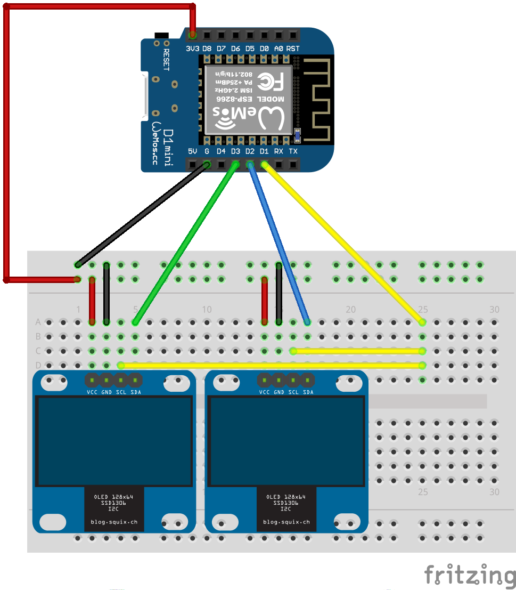

# Two Display Demo

## Overview

A demo for having two I2C SSD1306 0.96" OLED displays controlled independently by a [Wemos D1 Mini Pro](https://wiki.wemos.cc/products:d1:d1_mini_pro).

The Wemos D1 Mini (and Pro) has only one I2C controller.
Many of the commonly available SSD1306 displays have a fixed I2C address (0x3C).  This means that you can't address more than one of these displays from the same controller.  [It seems](https://github.com/Testato/SoftwareWire/wiki/Multiple-I2C-busses.) that it is possible to share the SCL pin between busses so you only need one additional digital pin for each additional I2C bus.

To use two (or more) I2C busses you need to reinitialize each one each time you want to use it.

This is a little working demo that uses Adafruit's [SSD1306 library](https://github.com/adafruit/Adafruit_SSD1306) and two displays.

## Wiring

